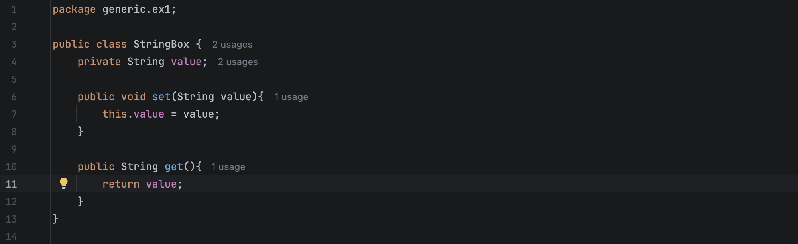
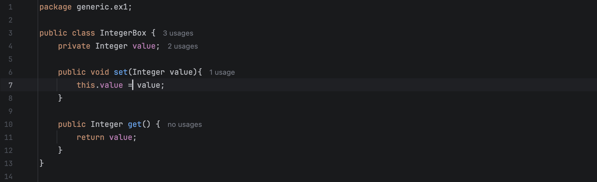
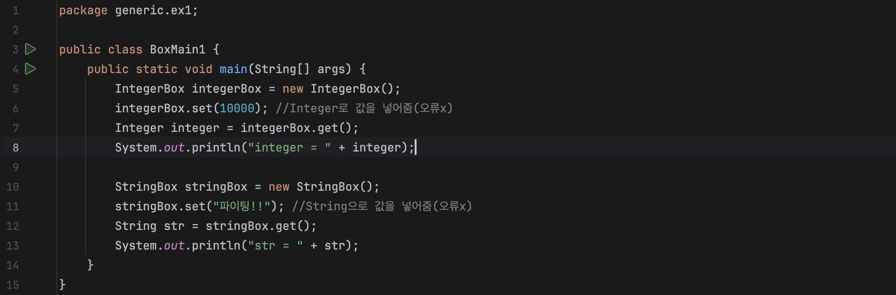
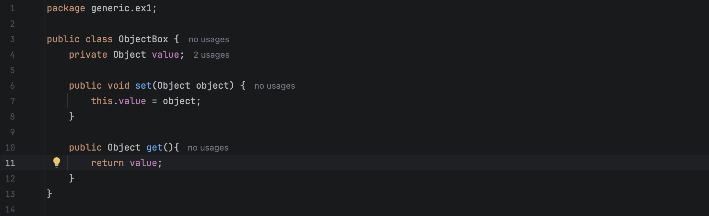
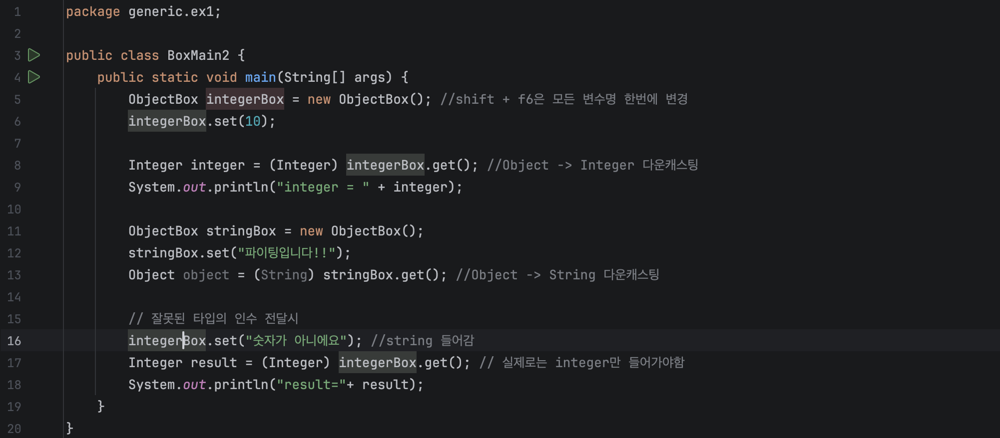
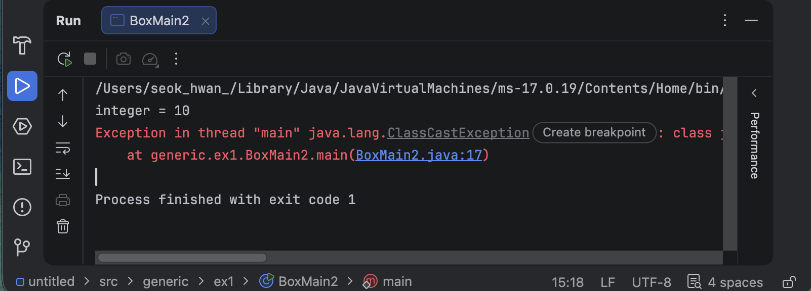
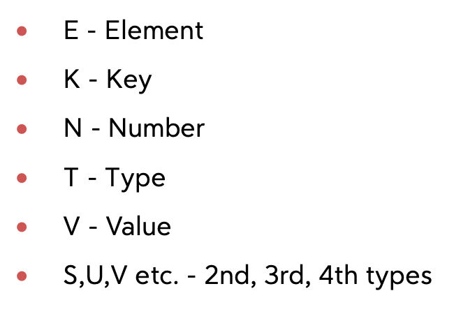
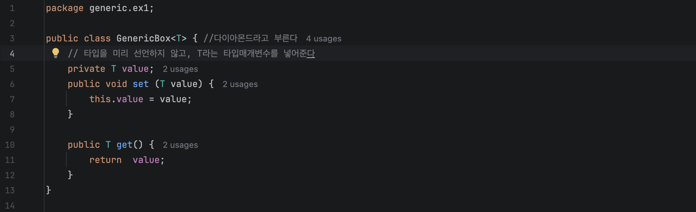
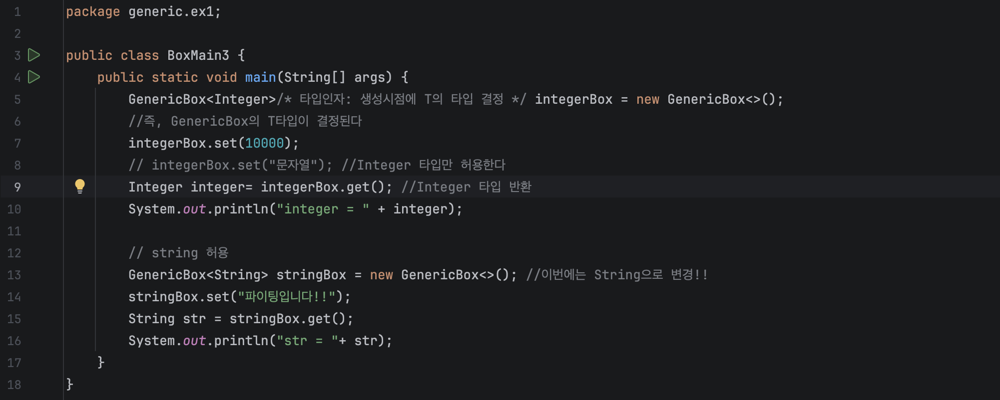

# 고급 Java [1] - 제네릭 (Generic)

## 목차

- [\[1\] 제네릭이 필요한 이유](#1-제네릭이-필요한-이유)
  - [타입마다 클래스를 만드는 경우](#타입마다-클래스를-만드는-경우)
  - [`Object` 클래스의 한계](#object-클래스의-한계)
  - [다운캐스팅과 `ClassCastException`](#다운캐스팅과-classcastexception)
- [\[2\] 제네릭의 구조](#2-제네릭의-구조)
  - [제네릭의 형태 `<T>`](#제네릭의-형태-t)
  - [타입 매개변수 관례 (T, E, K, V, N)](#타입-매개변수-관례-t-e-k-v-n)
  - [명칭 정리](#명칭-정리)
- [\[3\] 제네릭 적용하기](#3-제네릭-적용하기)
  - [`GenericBox<T>` 와 `BoxMain3`](#genericboxt-와-boxmain3)
  - [재사용성과 타입안정성](#재사용성과-타입안정성)
- [\[4\] 제네릭을 사용하면 좋은점](#4-제네릭을-사용하면-좋은점)

---

# [1] 제네릭이 필요한 이유

제네릭에 대해 설명하기 위해 먼저 간단한 예시를 들어보겠습니다

## 타입마다 클래스를 만드는 경우

`IntegerBox`와 `StringBox`에는 값을 저장하고 (`set`), 꺼낼 수 있습니다(`get`)

보다시피 `String`,`Integer`로 먼저 타입을 지정한걸 알 수 있습니다

`BoxMain1`에선 `set`에 값을 넣을때, 올바른 타입으로 넣어줘서 오류가 나지 않은걸 확인할 수 있습니다

하지만 이렇게 코드를 짠다면 Box의 종류를 `StringBox`,`IntegerBox` 이렇게 두가지로 만들어야하는데 그렇다면 <mark>재사용성이 떨어지겠죠?</mark>

## `Object` 클래스의 한계

`ObjectBox`를 보면 모든 타입의 부모인 `Object`를 사용해서 만든걸 볼 수 있습니다

이 `ObjectBox`를 사용하는 `BoxMain2`에서는 `(Integer)`로 다운캐스팅을 한 모습을 볼 수 있습니다

따라서 `Integer`형은 사용가능하지만 아래에 있는 “숫자가 아니에요” 는 <mark>실행시 오류</mark>가 나게됩니다

## 다운캐스팅과 `ClassCastException`

아래 보시면 `get()`의 반환타입이 `Object`라서 다른 타입이 안에 있어도 컴파일 오류가 생기지 않아, 개발자입장에서는 코드를 직접 빌드하기 전까지는 오류를 알 수 없습니다.(사진보여주기)

여기서 알고가면 좋은건, <mark>오류중에서는 컴파일오류가 제일 좋다</mark> 라는걸 알아주시면 좋습니다

즉, 이번에는 <mark>타입안정성</mark>에 문제가 생기고 있단걸 알 수 있습니다

**이러한 문제를 해결하기 위해 만들어진게 제네릭입니다**

---

# [2] 제네릭의 구조

## 제네릭의 형태 `<T>`

제네릭의 형태는 보통 `<T>` 이고 이 꺾쇠 안에 타입이 들어갈 자리를 만들어주게 됩니다

이 제네릭을 사용한다면 앞서 봤던 예제와 달리 <mark>타입을 미리 선언하지 않고</mark>, `T` 라는 타입매개변수를 넣어주게 됩니다

## 타입 매개변수 관례 (T, E, K, V, N)

`T`는 아래 보는것처럼 다양하게 바꿔쓸 수 있습니다(아래에 사진보여주기)

## 명칭 정리

여기서 한번 명칭을 정리해보고 가면 좋을것같아서 정리해보겠습니다

**타입매개변수(Type Parameter)**

클래스를 선언할때 `GenericBox<T>` 처럼 적어두는 `T` 입니다. <mark>아직 타입이 정해지지 않은 빈 자리</mark>라고 보시면 됩니다

**타입인자(Type Argument)**

객체를 만들때 `new GenericBox<Integer>()` 처럼 실제로 넣어주는 `Integer` 입니다. <mark>이 시점에 T의 타입이 결정됩니다</mark>

**다이아몬드 연산자**

`new GenericBox<>()` 처럼 `new` 뒤에서 타입을 비워둔 `<>` 를 말합니다. <mark>컴파일러가 왼쪽을 보고 타입을 추론</mark>해주기 때문에 비워둘 수 있는겁니다

---

# [3] 제네릭 적용하기

## `GenericBox<T>` 와 `BoxMain3`

이어서 `GenericBox`를 보시면 제네릭 유형으로 메서드가 구성된걸 볼 수 있습니다

이 메서드를 사용한 `BoxMain3`에서는 이 제네릭을 통해서 원하는 타입으로 자유롭게 변경이 가능합니다

## 재사용성과 타입안정성

만약 예제의 `stringBox`에서 `set`에다가 `Integer`형을 넣게 된다면 <mark>컴파일 오류</mark>가나서 더 큰 오류가 생기기전에 방지할 수 있습니다

<mark>재사용성</mark>과 <mark>타입안정성</mark>도 얻을 수 있습니다

---

# [4] 제네릭을 사용하면 좋은점

**1. 타입안정성이 확보됩니다**

잘못된 타입이 들어오면 실행해보기 전에 <mark>컴파일 단계에서</mark> 바로 걸러집니다

**2. 재사용성이 올라갑니다**

`StringBox`, `IntegerBox` 처럼 타입마다 클래스를 만들 필요 없이 `GenericBox<T>` 하나로 끝납니다
